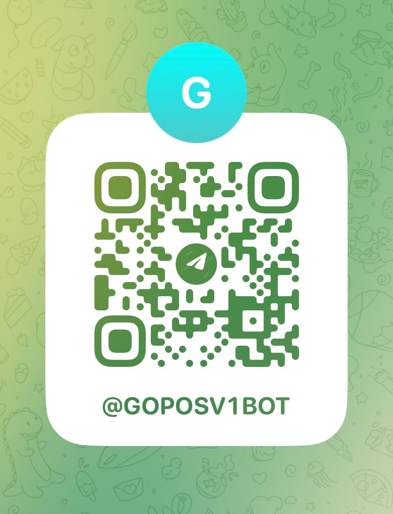

# go-pos-bot

#### Test APIs

```sh
curl -X POST -H "Content-Type: application/json" -d '{"code": "475072", "score": 1}' http://localhost:12345/api/qrcode/verify

curl http://localhost:12345/api/customers
```

#### Test BOT


