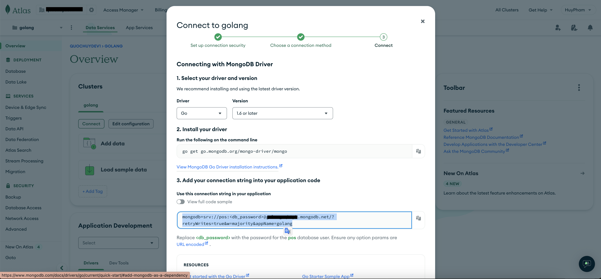
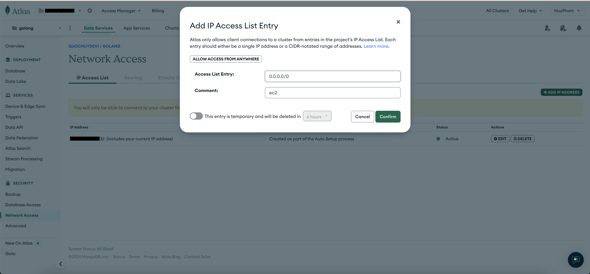

## DIY

### Manual create Telegram bot

#### Test BOT


### Setup free MongoDB Atlas

#### - Register a free mongo cluster

https://cloud.mongodb.com

#### - Create a new cluster



#### - Create a new cluster



### Deploy Golang in AWS EC2

OS: AWS Linux

```
uname -s

uname -m
```

If the outputs match Linux and x86_64, then the corresponding values in Go would be:

```
GOOS=linux GOARCH=amd64 go build -o myapp
```

#### Setup nginx

```sh
sudo yum update
sudo yum install nginx
```

```sh
sudo systemctl enable nginx
sudo systemctl status nginx
sudo systemctl start nginx
```

```sh
sudo mkdir -p /etc/nginx/conf.d
sudo nano /etc/nginx/conf.d/default.conf
```

```nginx
server {
    listen 80;

    location / {
        proxy_pass http://localhost:12345;
        proxy_set_header Host $host;
        proxy_set_header X-Real-IP $remote_addr;
        proxy_set_header X-Forwarded-For $proxy_add_x_forwarded_for;
        proxy_set_header X-Forwarded-Proto $scheme;
    }
}

server {
    listen 443 ssl;
    server_name yourdomain.com www.yourdomain.com;

    ssl_certificate /etc/letsencrypt/live/yourdomain.com/fullchain.pem;
    ssl_certificate_key /etc/letsencrypt/live/yourdomain.com/privkey.pem;
    include /etc/letsencrypt/options-ssl-nginx.conf;
    ssl_dhparam /etc/letsencrypt/ssl-dhparams.pem;

    location / {
        proxy_pass http://localhost:12345;
        proxy_set_header Host $host;
        proxy_set_header X-Real-IP $remote_addr;
        proxy_set_header X-Forwarded-For $proxy_add_x_forwarded_for;
        proxy_set_header X-Forwarded-Proto $scheme;
    }
}
```

```sh
sudo yum install certbot python3-certbot-nginx -y

sudo certbot --nginx -d yourdomain.com -d www.yourdomain.com
```

Test nginx

```sh
sudo nginx -t
```

expect: `nginx: configuration file /etc/nginx/nginx.conf test is successful`

```sh
sudo systemctl reload nginx

# or

sudo systemctl restart nginx
```

### Integrate to POS application

#### Test APIs

```sh
curl -X POST -H "Content-Type: application/json" -d '{"code": "889351", "score": 1.2}' http://localhost:12345/api/qrcode/verify

curl http://localhost:12345/api/customers
```

```curl
NGROK_URL=https://34ef-2402-800-63ba-80c9-895e-458f-d016-7f38.ngrok-free.app
SHOPIFY_TOKEN=

curl -X POST "https://quickstart-fa54a928.myshopify.com/admin/api/2023-07/webhooks.json" \
-H "X-Shopify-Access-Token: $SHOPIFY_TOKEN" \
-H "Content-Type: application/json" \
-d '{
  "webhook": {
    "topic": "orders/create",
    "address": "'$NGROK_URL'/api/shopify/webhook",
    "format": "json"
  }
}'
```

==> webhook_id:1660397355317

```curl
NGROK_URL=https://34ef-2402-800-63ba-80c9-895e-458f-d016-7f38.ngrok-free.app
SHOPIFY_TOKEN=

curl -X POST "https://quickstart-fa54a928.myshopify.com/admin/api/2023-07/webhooks.json" \
-H "X-Shopify-Access-Token: $SHOPIFY_TOKEN" \
-H "Content-Type: application/json" \
-d '{
  "webhook": {
    "topic": "orders/updated",
    "address": "'$NGROK_URL'/api/shopify/webhook",
    "format": "json"
  }
}'
```

==> webhook_id:1660406628661

```curl
NGROK_URL=https://34ef-2402-800-63ba-80c9-895e-458f-d016-7f38.ngrok-free.app
SHOPIFY_TOKEN=

curl -X PUT "https://quickstart-fa54a928.myshopify.com/admin/api/2023-07/webhooks/1660397355317.json" \
-H "X-Shopify-Access-Token: $SHOPIFY_TOKEN" \
-H "Content-Type: application/json" \
-d '{
  "webhook": {
    "topic": "orders/create",
    "address": "'$NGROK_URL'/api/shopify/webhook",
    "format": "json"
  }
}'

SHOPIFY_TOKEN=

curl -X GET "https://quickstart-fa54a928.myshopify.com/admin/api/2023-07/webhooks.json" \
-H "X-Shopify-Access-Token: $SHOPIFY_TOKEN"
```

```curl
SHOPIFY_TOKEN=
SHOPIFY_STORE_URL=https://quickstart-fa54a928.myshopify.com

curl -X POST "$SHOPIFY_STORE_URL/admin/api/2023-07/customers.json" \
-H "X-Shopify-Access-Token: $SHOPIFY_TOKEN" \
-H "Content-Type: application/json" \
-d '{
  "customer": {
    "first_name": "John",
    "last_name": "123123123"
  }
}'
```
